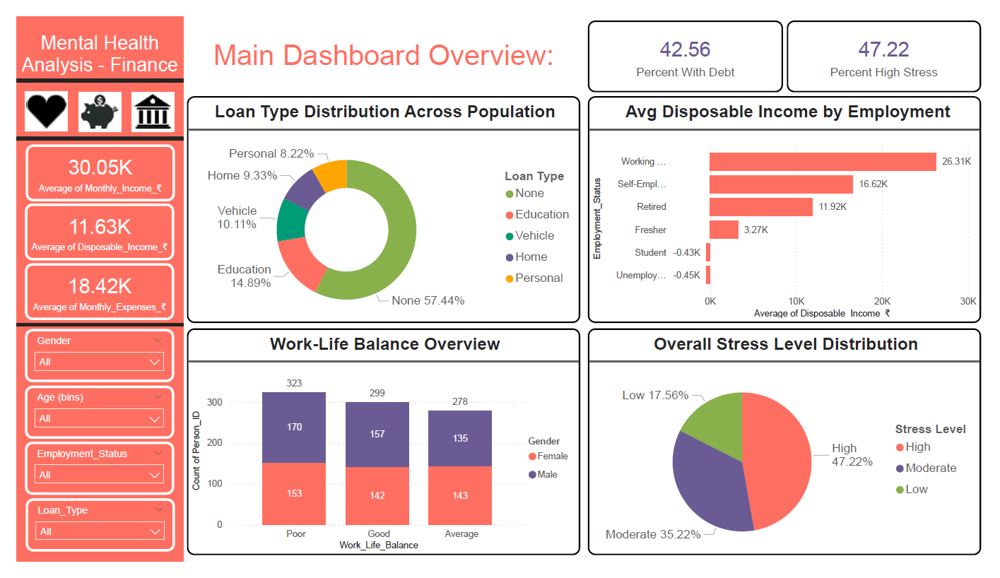

# 📊 Mental Health Analysis – Finance (Power BI Dashboard)
Welcome to my data visualization project that explores the intersection between **financial conditions and mental health**. This dashboard was created using **Power BI**, supported by Python-generated data, and deployed for online viewing with GitHub Pages.

---

## 🔍 Project Summary

This project simulates financial and mental health conditions across 900 individuals and analyzes patterns related to:
- Income vs Expenses
- Debt and Loan Types
- Work-Life Balance
- Job Security
- Savings Behavior
- Stress Levels

> 🎯 The goal is to reveal how personal finances and employment status can impact an individual's mental well-being.

---

## 🌐 Live Dashboard

🧠 **View Full Project Page:**  
🔗 [https://harshad912004.github.io/Mental_Health_Analysis-Finance/](https://harshad912004.github.io/Mental_Health_Analysis-Finance/)

> Includes dashboard previews, downloadable files, project insights, and styling — all hosted on GitHub Pages.

---

# 🖼️ Preview

---

## 📂 Project Structure

| File | Description |
|------|-------------|
| `index.html` | Portfolio landing page hosted via GitHub Pages |
| `Mental_Health_Analysis-Finance.pbix` | Power BI report file |
| `Finance_Dataset.csv` | Final dataset used for the dashboard |
| `Mental_Health_Analysis-Finance.pdf` | Static export of the dashboard (PDF) |
| `screenshots/` | Folder containing dashboard preview images |

---

## 🧠 Key Insights

- **47.22%** of the population reports high stress
- **42.56%** live with some form of debt
- **35.89%** have poor work-life balance
- **75.67%** lack job security
- **44.44%** save less than 20% of their income
- Students and unemployed individuals show **negative** disposable income

---

## 💼 Tools & Technologies Used

- 🐍 Python (data simulation & CSV creation)
- 📊 Microsoft Power BI (dashboard, KPIs, slicers, visuals)
- 📁 Excel (data cleaning, preprocessing)
- 🖥 HTML + CSS (project landing page)
- ☁️ GitHub Pages (deployment)

---

## 🧑‍💻 My Contribution

- Designed and generated the dataset (Python & logic modeling)
- Built 4-page dashboard with KPIs, dynamic filters, slicers, and custom charts
- Designed and deployed HTML/CSS landing page for portfolio
- Implemented conditional formatting and storytelling insights
- Created visual slide carousel, download buttons, and scroll-to-top UX

---

## 🛠️ Challenges Faced

- Power BI’s free license doesn’t allow direct "Publish to Web" → used PDF as fallback initially
- Implemented responsive image slider manually without JS libraries
- Styled everything manually for desktop presentation view

---

## 🚀 Future Enhancements

- Add drill-through pages in Power BI
- Use real-world financial wellness or stress datasets
- Integrate a chatbot or survey analysis into the dashboard
- Enable mobile-friendly layout and animation transitions

---

## 🔗 Connect With Me

💼 [Connect on LinkedIn](https://www.linkedin.com/in/harshad-dhongade)  
💻 [Visit My Personal Portfolio](https://harshad912004.github.io/Harshad_Portfolio/)

---

## 📜 License

This project is shared for academic and portfolio purposes. You are welcome to view, use, or adapt the content with credit.

---

> ✨ *Crafted with passion by Harshad — aspiring Data Analyst & Power BI Developer.*
